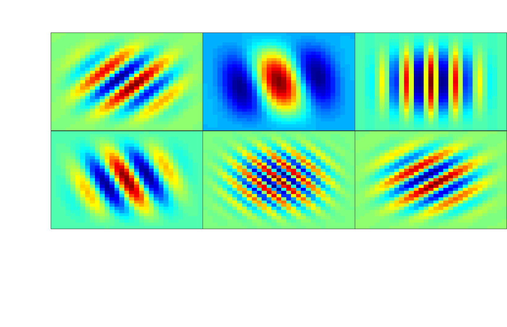

# modulation-domain-loss-ICASSP2021

Official repo for the PyTorch implementation of the spectro-temporal modulation-domain loss to appear in ICASSP 2021

Modulation loss function used for training DNN-based speech enhancement systems \
Can combine with any other loss function

[[Arxiv](https://arxiv.org/pdf/2102.07330.pdf)]

See example usage in <code> modulation_loss.py </code>

# Gabor Kernel Examples

# A MODULATION-DOMAIN LOSS FOR NEURAL-NETWORK-BASED REAL-TIME SPEECH ENHANCEMENT
### Citation

```
@misc{vuong2021modulationdomain,
      title={A Modulation-Domain Loss for Neural-Network-based Real-time Speech Enhancement}, 
      author={Tyler Vuong and Yangyang Xia and Richard M. Stern},
      year={2021},
      eprint={2102.07330},
      archivePrefix={arXiv},
      primaryClass={eess.AS}
}

```
